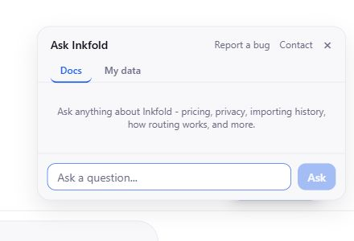

# Inkfold — Alpha Feedback

This repository is for bug reports and product feedback during the Inkfold
alpha. It contains no source code — it is an issue tracker only.

Inkfold is built on the **FusionLayer** engine (https://fusionlayer.app),
which provides the cross-model memory, the privacy modes, and the
multi-model comparison behind the app.

## Inkfold environments

- Production: https://app.inkfold.app
- Tester environment: https://test.inkfold.app (planned)

Use the tester environment for assigned staging work once access is provided.
It will use separate data from production.

## Before you start testing

- [docs/KNOWLEDGE-BASE.md](docs/KNOWLEDGE-BASE.md) — what Inkfold is, the
  feature tour, and what's solid vs. still rough in the alpha.
- [docs/TEST-SCENARIOS.md](docs/TEST-SCENARIOS.md) — step-by-step scenarios
  to try per feature area.

## Reporting a bug

The quickest way to report a bug is directly inside Inkfold:

1. Open the **Ask Inkfold** chat window in the lower-right corner.
2. Click **Report a bug** in the chat window header.
3. Complete the pre-filled GitHub issue and add your reproduction details.

The link opens a pre-filled issue with safe route and environment details. You
can also open a new issue here and choose the appropriate template.

Please include:

1. Steps to reproduce
2. Expected vs. actual behavior
3. Environment (OS, browser/version if relevant)
4. Screenshots or logs if you have them, after checking that they contain no private information

Do not post prompts, conversation content, personal data, API keys, access
tokens, or security/privacy reports publicly. See [SECURITY.md](SECURITY.md) for
the private-reporting rule.
